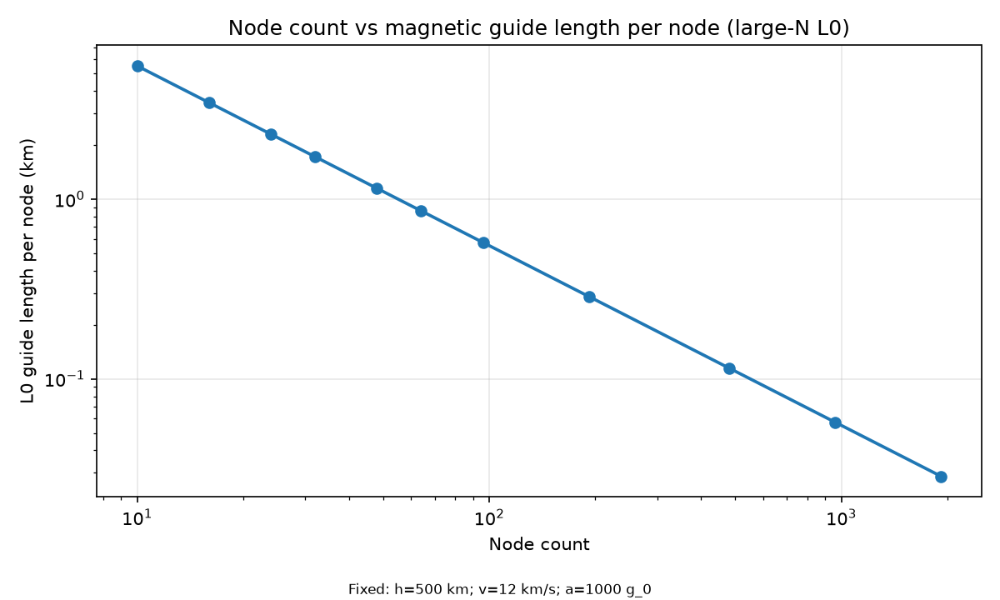
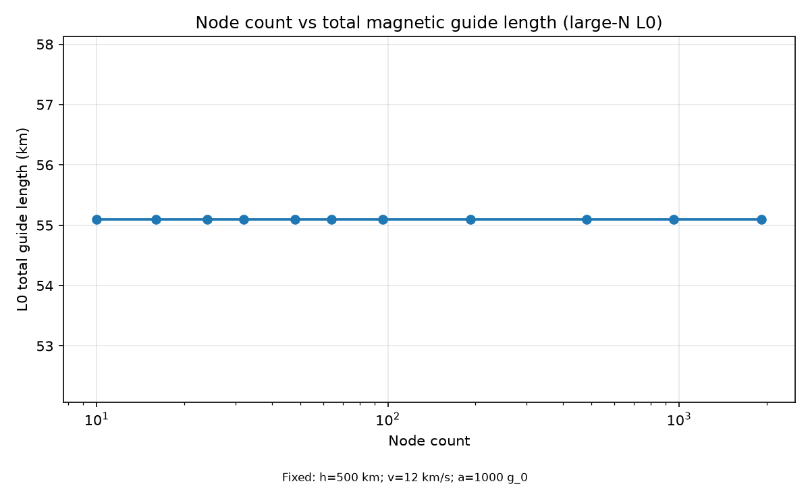
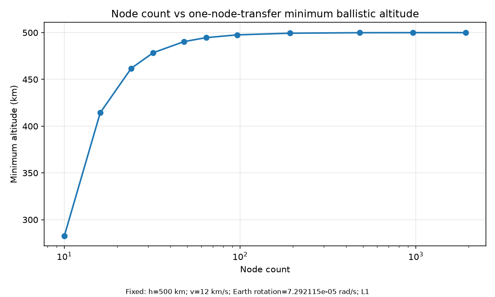
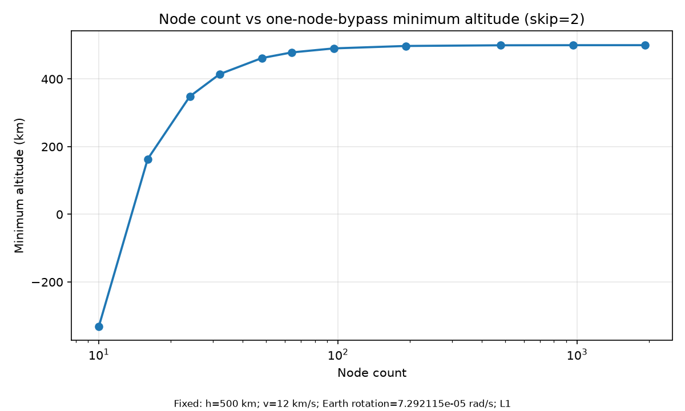
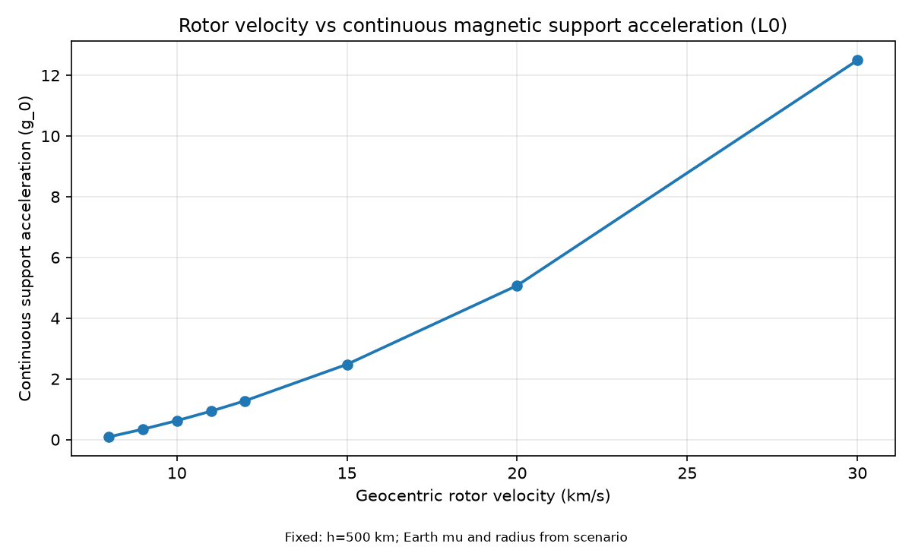
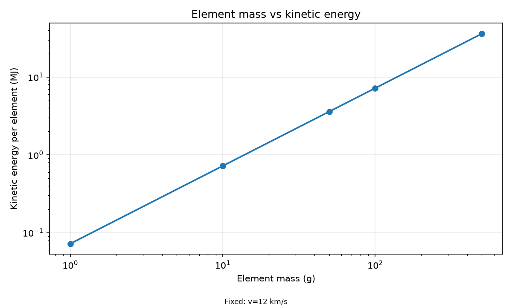
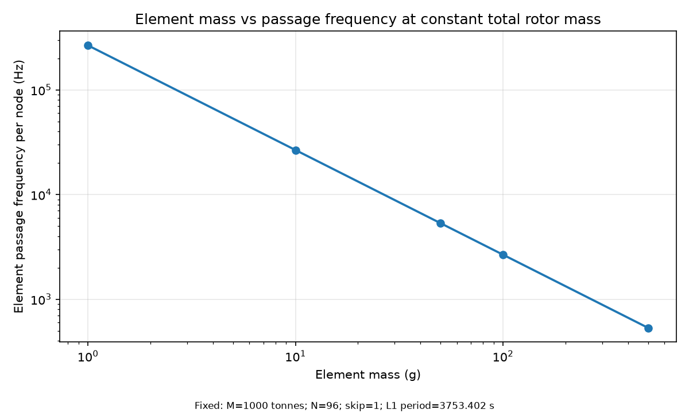

# OR-0 / OR-1 baseline report

Scenario: `or1-reference-500km-96n-12kms`  
Configuration hash: `4b6553b0d4295b6df9519d012c1c6d571c827b89867fa644bfd3d9f589a5f023`  
Fidelity: L0 closed-form scaling and L1 numerical two-body propagation

## Reference results

| Quantity | Value |
|---|---:|
| Geocentric radius | 6871.000 km |
| Gravity at ring | 8.443021 m/s² |
| Circular velocity | 7.616561 km/s |
| Escape velocity | 10.771444 km/s |
| Continuous magnetic support | 12.514627 m/s² |
| L0 magnetic turning angle | 3.751934 rad |
| L0 magnetic curvature radius | 14.683913 km |
| L0 total active guide length | 55.093079 km |
| L0 guide length per node | 573.886 m |
| L1 flight time | 39.097941 s |
| L1 minimum altitude | 497.607806 km |
| L1 active deflection angle | 0.04078389 rad |
| L1 required delta-v | 489.372781 m/s |
| Elements | 20,000,000 |
| Passage frequency per node | 5,328.498848 Hz |
| Kinetic energy per element | 3.600000 MJ |
| Average node reaction force | 130.381115 kN |
| Force cross-check relative error | 1.439e-13 |

L0 guide-length results are large-N scaling approximations. L1 treats nodes as
points and integrates only spherical two-body gravity while the target node
rotates with Earth.

## Plots

## Warnings

- Rotor speed is at or above local two-body escape velocity.
- L0 guide lengths are large-N scaling approximations.
